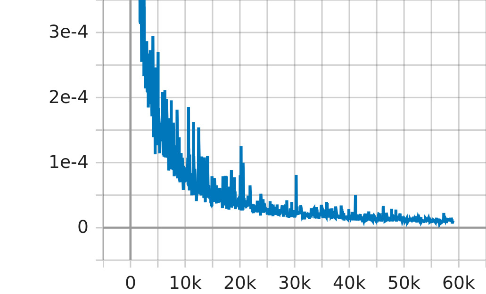
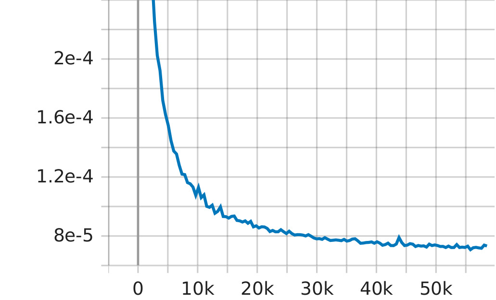
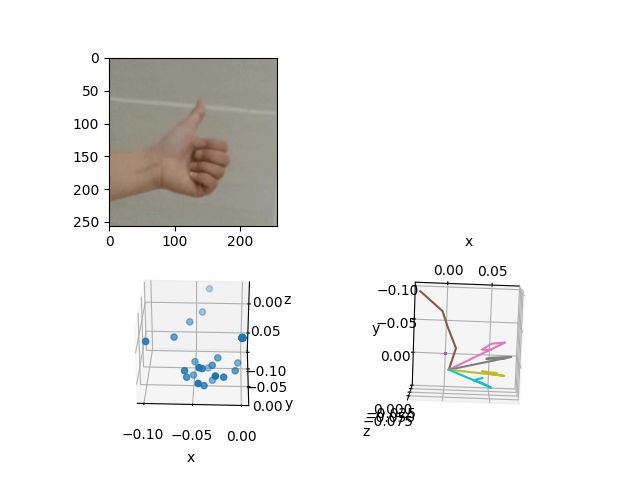

# Estimation of 3D Hand Posture from RGB Image Inputs
## Introduction
Virtual Reality (VR) is one of the most popular concepts of recent game development. Nowadays players can easily access to the virtual environment by purchasing various VR devices, and all of these devices include hand controllers so game developers can simulate hand post in game. However, regular hand controllers have less degree of freedoms and can only detect a few hand gestures, while other more sensitive and accurate controllers are expensive and not wildly used.
Not only in games, VR and AR has been expected to be the next generation user-interface technology that shifts from classic 2-Dimension (keyboard and mouse) to 3-Dimension, which will dramatically increase efficiency. So in order to develop a more accessible solution, we propose an idea that uses a single camera to detect 3d hand post, without using any external devices.

## METHODS
### Hand Skeleton key points Prediction
Inspired by recent success of Transfomers on computer vision, we decided to finetune the Swin-Transformer to reach our goal. The model has a pre-trained feature extractor, which can automatically transform an image of any size into a 225 * 225 feature vector. We removed the original output layer of Swin and added a new full connected layer to output 43 different vectors of size 3. Each of these vectors indicates the 3d location of a keypoint on hand, and, therefore, we can reconstruct the hand post in the virtual environment.
### Visualization
We projected the 42 key points of both hands and rendered the hand posture in 3D space. Then we will connect these key points in 3D space, to show the outline of 10 fingers. Thus providing the overall posture of the hand.
The final product is an interactive visualization of posture and position of both hands.
## Dataset
### HIU-DMTL Dataset
This dataset is from paper ["Hand Image Understanding via Deep Multi-Task Learning"](https://arxiv.org/abs/2107.11646) and you can find its detail description in the [repo](https://github.com/MandyMo/HIU-DMTL).

We are using the RGB Image and pts3d_2hand labels to train our model
## Result

train loss              |  test loss 
:-------------------------:|:-------------------------:
  |  

Figures above show the train loss and test loss over training steps. It shows a clear decrease in error and thus our model converges. Also, the test loss is nearly monotony decreasing, which indicates that our model does not overfit on train data and has a good performance on generalization.

Above Figure is the result of running the model on a new image.
The top-left is the input, a 2D RGB photo of a single left hand.
The model predicted 3D coordinates of 21 key points of the hand skeleton.
The left graph shows the scattering of the predicted skeleton key points in 3D space. The right graph shows the connected key points in the order of finger skeleton. (mirrored according to x-y plane) We can see the gesture of the skeleton is exactly the same as in the original 2D RGB hand photo.
The result is amazingly good in both the train loss function and in real world use case.

## Difficulties and Challenges
At first we tried to design a CNN model and used the Rendered Hand Post Dataset to solve the problem. However, after several rounds of tuning the hyperparameters, our models gave a unacceptably poor result on training dataset. At this point, we realized that the dataset is of low quality and therefore we turn to search for a better data source. Fortunately, Baidu provided us with high resolution images and accurate labels, and thus we can move on to tuning our model.
Strengths and Weaknesses
The model shows a generally good result of estimating a 3d hand post of a hand. However, we found that all images in the dataset are either left hand or right hand, and thus the performance of our model on two-hand or even multi-hand situations is still unknown.
## Future Work
Efficiency Improvement
Right now running the model on a single image takes about 2 seconds. It is possible to improve this speed to 100 ms level with various methods, to use it in near real-time.
Real World usage: Real-time Hand Gesture in VR games
In the future, it is possible to use this model in a VR game, showing hand gestures in the game with a single camera, without the use of controllers.
We can use a single camera to take pictures of people’s hands in real-time, use our trained model to predict its corresponding hand gestures, do a re-rendering of hands based on the skeleton key points and show the rendered hands in game screen space.
This method enables gamers with deeper immersion. And it does not require expensive custom-made controllers
 